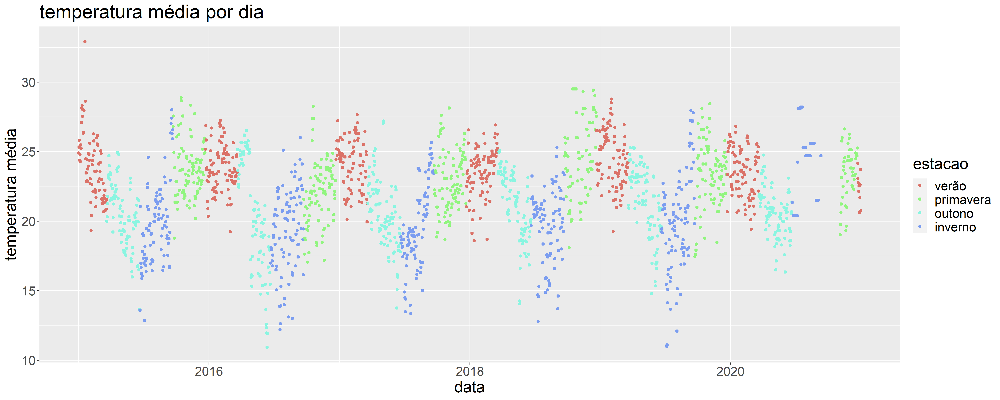
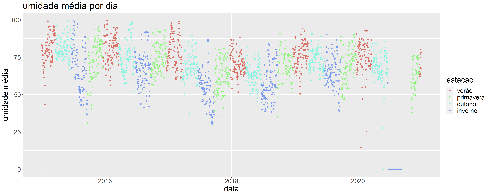
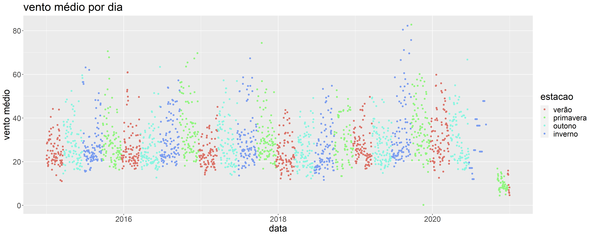
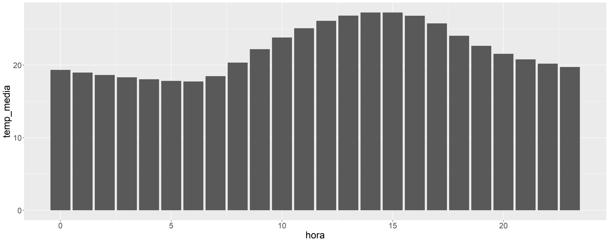
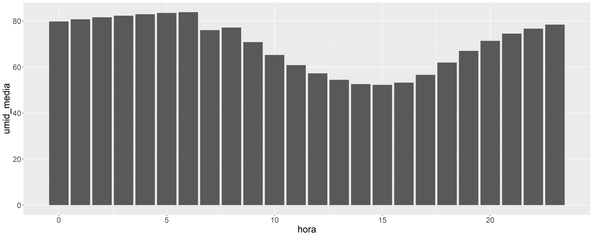
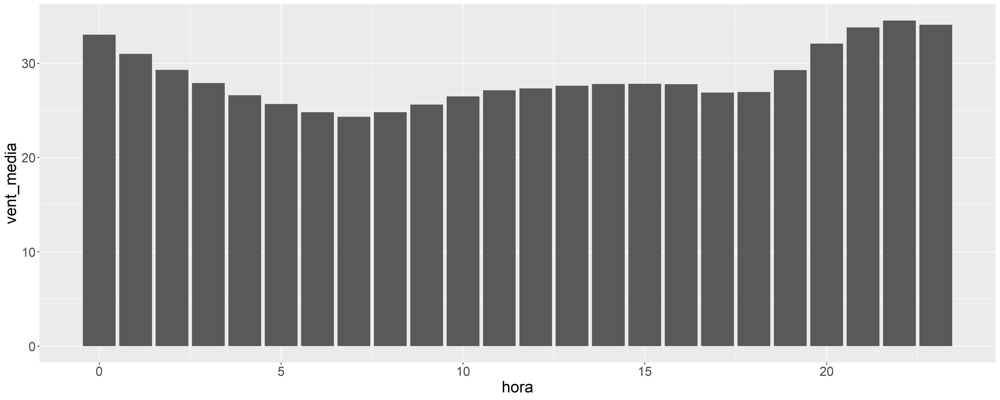
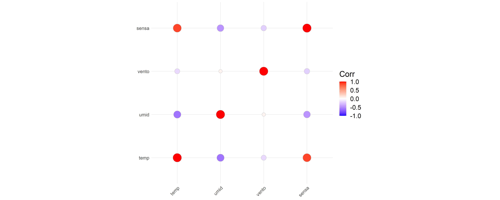
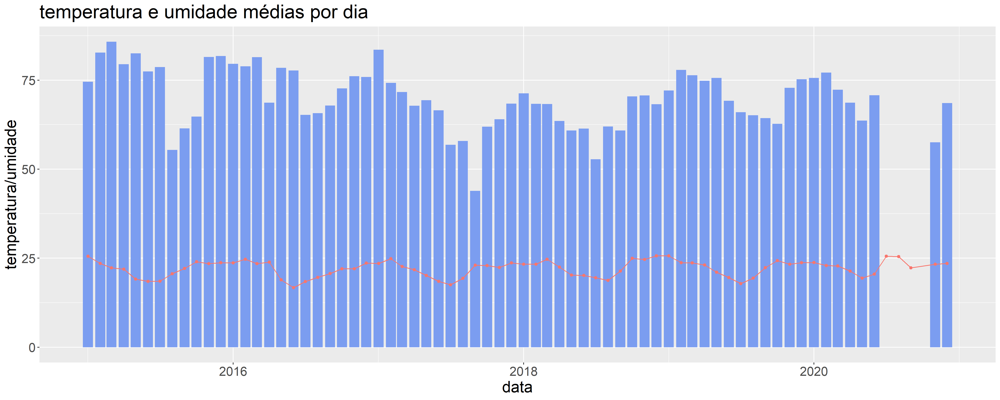
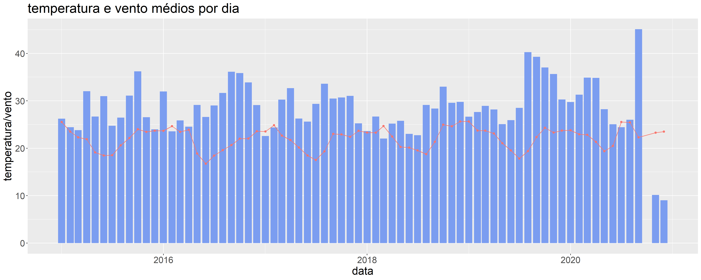

```{r load-packages, include=FALSE}
library(ggplot2)
library(dplyr)
library(lubridate)
library(tidyverse)
library(knitr)
```

## Integrantes

* **19164** - Bruno Arnone Franchi
* **19191** - Nícolas Denadai Schmidt


## Introdução

Este relatório descreve as análises feitas por nosso grupo sobre os dados meteorológicos do Cepagri/Unicamp, no período correspondido de 01/01/2015 a 31/12/2020. Os dados foram lidos de um arquivo CSV, disponível [aqui](https://ic.unicamp.br/~zanoni/cepagri/cepagri.csv).

```{r}
# fazer download do arquivo, se necessário
if (!file.exists("cepagri.csv")) {
  download.file("http://ic.unicamp.br/~zanoni/cepagri/cepagri.csv", "cepagri.csv")
}

# ler dataset .csv
names <- c("horario", "temp", "vento", "umid", "sensa")
cepagri <- read.csv("cepagri.csv", header = FALSE, sep = ";", col.names = names)
```


### Tratamento de dados

Fizemos um tratamento inicial aos tipos de dados, para que a coluna de `horario` fosse lida como Data; e a coluna `temp` fosse, assim como as outras, lida como Número. Além disso, removemos as entradas com erros de leitura.

```{r}
# criar dataframe, tratar tipos de coluna e erros
df <- data.frame(cepagri)
# ignorar warning de leituras N/A, vamos corrigir isso na próxima linha
suppressWarnings({
  df <- df %>%
    mutate(horario = as_datetime(df$horario, format = "%d/%m/%Y-%H:%M")) %>%
    mutate(temp = as.numeric(df$temp))
})
df <- na.omit(df)
```

Depois, extraímos o período de tempo que vamos estudar: do primeiro dia de 2015 ao último dia de 2020.

```{r}
# extrair dados entre 2015-01-01 e 2020-12-31
df <- df[
  df$horario >= "2015-01-01" &
    df$horario <= "2020-12-31",
]
```


## Estações do Ano

Nessa análise, esperamos encontrar relações entre a estação do ano e as leituras de temperatura, umidade, e vento.

### Temperatura



Ao analisar as médias de temperatura, podemos claramente relacioná-las às estações do ano, visto que o verão se destaca com médias mais altas; e o inverno com médias mais baixas.

Enquanto isso, primavera e verão aparecem como épocas de "transição" entre os dois extremos, com as temperaturas caindo ao longo do outono, e se elevando ao longo da primavera.

### Umidade



Assim como na análise de temperatura, é facil perceber diferenças entre as estações: em geral, o verão apresenta umidade maior e o inverno umidade menor, com as estações restantes apresentando dados similares entre as duas outras estações.

### Vento



Ao analisar o gráfico de vento médio visualmente, não se percebe diferenças significativas entre cada estação.

Vamos confirmar a baixa correlação entre vento e os outros dados quando analisarmos a matriz de correlação entre eles.


## Ao Longo do Dia

Como nossa segunda analise, decidimos estudar quais eram as temperaturas, taxas de umidade e velocidades do vento médias por hora no período em questão, como visto nos gráficos a seguir:

### Temperatura



Ao analisar o gráfico da temperatura média por hora, descobrimos que a temperatura tende a aumentar progressivamente das 6:00 da manhã até as 15:00 da tarde, quando atinge seu pico, e então diminuir até as 6:00 da manhã do dia seguinte.

### Umidade



Em contrapartida, ao analisar o gráfico de umidade média por hora, podemos observar que seu comportamento é o oposto do esperado após realizar a análise das relações entre as estações do ano, e a temperatura, umidade e velocidade do vento, onde a umidade tendia a ser maior quanto maior fosse a temperatura. Aqui, vemos que a umidade encontra-se em seu pico as 6:00 da manhã, de onde diminui até atingir seu mínimo às 15:00 da tarde, para então aumentar até as 6:00 da manhã do dia seguinte.

### Vento



O comportamente da velocidade do vento observada no gráfico de velocidade do vento média por hora por outro lado, é bem curioso, a velocidade do vento tende a atingir seu ponto mínimo as 7:00, permanece sem grandes mudanças até as 18:00 da tarde, e então aumenta até atingir seu ponto máximo às 22:00 da noite, diminuindo, gradualmente, até as 7:00 do próximo dia, sendo assim, maior durante o período noturno, e menor durante o dia.


## Correlação entre Dados

A melhor forma de encontrar relações entre dados coletados é com uma matriz de correlação.

Vamos, então, gerar uma matriz de correlação entre todas as colunas de dados coletados.

```{r echo = FALSE, results = 'asis'}
kable(cor(df[,c("temp", "umid", "vento", "sensa")]))
```



### Temperatura, Umidade e Vento

Ao analisar a correlação entre umidade/vento e temperatura, podemos notar que:

* **umidade**: correlação de **-60%**
* **vento**: correlação de **-16%**

Com isso, podemos concluir que tanto o vento quanto a umidade tendem a ocorrer em conjunto com baixas temperaturas, sendo a relação temperatura-umidade mais forte do que a relação temperatura-vento. O mesmo pode ser observado nos gráficos a seguir:





### Sensação Térmica

A primeira vista, quando analisamos a matriz podemos perceber que a correlação em maior destaque é que a temperatura afeta diretamente a sensação térmica, sendo aproximadamente 88% relacionadas. Isso faz sentido, porque, se estiver mais calor, as pessoas provavelmente vão sentir mais calor.

Além dessa, podemos encontrar outras correlações:

* **aprox. 88%** temperatura: maior temperatura causa maior sensação térmica
* **aprox. -58%** umidade: menor umidade causa maior sensação térmica
* **aprox. -21%** vento: menos vento causa maior sensação térmica


## Crise Hídrica de 2014-2015

Houve uma grande e famosa crise hídrica em todo o Brasil nos anos de 2014 e 2015. Levando em conta que temos em mãos os dados do CEPAGRI de 2015, um dos anos da crise, decidimos analisar a umidade no ano de 2015 usando o gráfico de umidade diária.


Vemos no gráfico que a umidade no começo de 2015 estava comparativamente alta com relação ao mesmo período dos demais anos da análise. Tal resultado nos deixou surpresos, uma vez em que acretitávamos que a umidade relativa do ar tenderia a ser menor com relação à um ano sem crise hídrica. Talvez a água que estava em falta tivesse evaporado e se encontrava no ar, o que explicaria a elevada umidade do ar, embora deixaria questões sobre o por que da falta de chuvas.